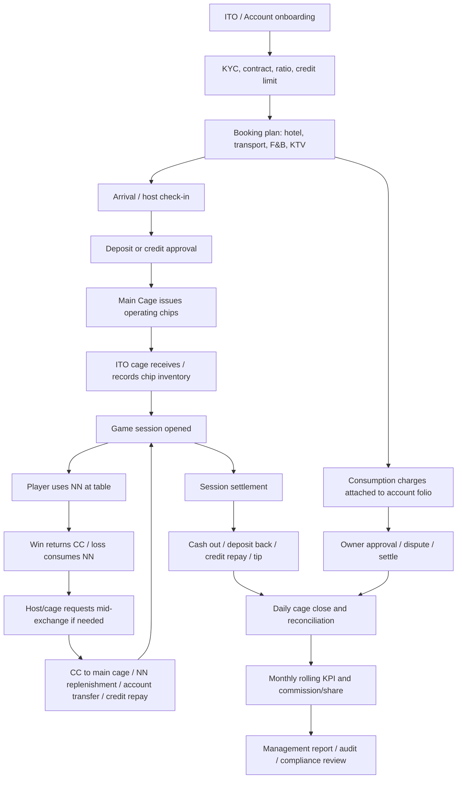
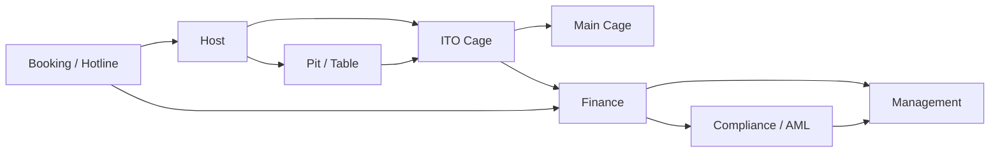

# YiDing ITO Cage Operations - Audit And Master Plan

Status date: 2026-06-01  
Workspace: `C:\Users\LENOVO\Documents\Codex\2026-05-25\https-fmcapp-com-palace-dashboard-assets`  
Primary repo folder: `landing-page`  
Reference system: `https://fmcapp.com/palace`  
Business target: YiDing-owned ITO cage, rolling, booking, credit, settlement and hospitality operating system.

Latest QA checkpoint: 2026-06-03.

This document is the handoff source of truth for any AI/developer continuing the work. Read this before editing code.

## 1. Executive Summary

The current Palace reference system is best understood as an ITO/junket backoffice for casino operations. It is not merely a transaction form. It models account money, chip sessions, credit, consumption, settlement reports and operational history.

YiDing should not clone it blindly. The right target is a stronger system with three layers:

1. Casino finance ledger: main cage, ITO cage, account balance, chip inventory, credit, settlement.
2. Hospitality workflow: booking, transport, hotel, F&B, KTV, incidents and customer service cost capture.
3. Management intelligence: rolling KPI, commission/share, reconciliation, AML/risk, audit, staff accountability.

Current implementation in `landing-page` has a native `Palace Operations` module that calls Palace through a same-origin proxy. It already supports core operations, but it is still a bridge/prototype, not the final YiDing-native system.

## 2. Current Code Audit

### 2.1 Files Already Touched

- `landing-page/assets/js/home.js`
  - Adds `Palace Operations` panel.
  - Handles Palace login, forms, records, active sessions, settlement snapshot/detail.
  - Contains IT Agent panel and WhatsApp DB command wiring.
- `landing-page/assets/css/home.css`
  - Adds Palace native surface, table, detail and row action styles.
- `landing-page/vite.config.mjs`
  - Adds dev proxy for `/api/palace/*`.
  - Adds Palace dashboard snapshot parser for settlement reports.
- `landing-page/api/palace/[[...path]].js`
  - Adds production/serverless proxy for Palace API and snapshot routes.
- `palace_compare_probe.py`
  - Python/Selenium/requests probe for live Palace comparison.
- `bulk_agent_month_simulation.py`
  - Bulk test data runner for Palace transactions.
- `landing-page/src/features/ito-operations`
  - Owned YiDing ITO domain scaffold for ledger, workflow, chip ratio, rolling KPI, booking and Palace adapter helpers.
- `landing-page/src/features/ito-operations/ui/palace-render-helpers.mjs`
  - Extracted pure Palace UI helper layer for HTML escaping, amount display, currency options, customer/session options, operation tabs, operation-specific cage form fields, table rows, credit/consumption/session/settlement row action renderers, and settlement filter/pager controls.
- `landing-page/tests/ito-domain.spec.js`
  - Tests ITO domain invariants.
- `landing-page/tests/ito-palace-adapter.spec.js`
  - Tests Palace path/payload helpers and amount scaling.
- `landing-page/tests/ito-palace-ui.spec.js`
  - Tests extracted Palace UI helper escaping, stable HTML output, operation-specific cage form field output, row action renderers and settlement filter/pager controls.
- `landing-page/tests/ito-palace-operations.spec.js`
  - Mocked Palace API E2E for the YiDing Palace Operations panel. Verifies YiDing admin session, Palace login, AGENT TEST active session loading, native mid-exchange submit, native tip submit, core cage operation payloads, settlement detail, quick close, detailed settlement, credit void, consumption settle/void and export URL handling without live Palace mutation.

### 2.2 Working As Of This Audit

`npm run build` passes on 2026-06-01.

`npx playwright test tests/ito-domain.spec.js tests/ito-palace-adapter.spec.js tests/ito-palace-ui.spec.js tests/ito-palace-operations.spec.js` passes with 19 tests on 2026-06-03.

`npm run build` passes on 2026-06-03.

Native YiDing module has already covered:

- Palace login through same-origin proxy.
- Customer loading.
- Deposit.
- Withdraw.
- Account transfer.
- Game start.
- Credit borrow.
- Credit repay.
- Credit void.
- Consumption create.
- Consumption settle.
- Consumption void.
- Active game sessions.
- Settlement list via Palace dashboard snapshot scrape/proxy.
- Settlement filters and pagination.
- Settlement detail viewer through `/api/settlement-records/:id`.
- Transaction export and settlement export through proxy.

Live Palace endpoints confirmed during probing:

- `POST /api/auth/login`
- `GET /api/auth/me`
- `GET /api/customers`
- `GET /api/transactions`
- `POST /api/transactions`
- `GET /api/credit-records`
- `POST /api/credit-records`
- `POST /api/credit-records/:id/void`
- `GET /api/consumption-records`
- `POST /api/consumption-records`
- `POST /api/consumption-records/:id/settle`
- `POST /api/consumption-records/:id/void`
- `GET /api/game-sessions?status=ACTIVE`
- `POST /api/game-sessions/:id/settle`
- `POST /api/game-sessions/:id/tip`
- `POST /api/game-sessions/:id/mid-exchange`
- `GET /api/settlement-records/:id`
- `GET /api/exports/transactions`
- `GET /api/exports/settlement-records`

Captured payloads:

```json
{
  "settle_quick_close": {
    "remainingNn": 0,
    "remainingCc": 0,
    "settleCashOut": 0,
    "settleToAccount": 0,
    "tipNn": 0,
    "tipCc": 0
  },
  "settle_detailed": {
    "remainingNn": 0,
    "remainingCc": 0,
    "settleCashOut": 0,
    "settleToAccount": 0,
    "tipNn": 0,
    "tipCc": 0,
    "tipTargetType": "STAFF",
    "remarks": "UI probe detailed settle",
    "creditRepayAmount": 0
  },
  "tip": {
    "amountNn": 100,
    "amountCc": 0,
    "targetType": "STAFF"
  },
  "mid_exchange": {
    "kind": "CASH_OUT",
    "amountNn": 0,
    "amountCc": 100,
    "creditRepayAmount": 0,
    "isCreditRepayOnly": false
  }
}
```

Important scaling observation: Palace UI input `0.01` was submitted as `100` for `tip` and `mid-exchange`, so the backend likely stores chip/money units in a scaled integer format for those routes. Do not normalize this blindly until the adapter layer is formalized.

### 2.3 Incomplete / In-Progress

- Native `session settle` form exists.
- Native `tip` and `mid-exchange` forms/actions are now wired into YiDing.
- Current active-session `Mid` and `Tip` buttons open native forms; each form still includes a legacy fallback button.
- Legacy fallback URLs now use `PALACE_BASE_URL`, avoiding bad `.../login/dashboard/...` concatenation.
- Mocked Palace E2E now covers the native YiDing flow for Palace login, active AGENT TEST session display, core cage operations, mid-exchange submit and tip submit. It asserts:
  - Deposit, withdrawal, transfer, game start, credit borrow, credit repay and consumption submit Palace-shaped payloads.
  - Mid-exchange input `0.01` CC submits `amountCc: 100`.
  - Tip input `0.02` NN submits `amountNn: 200`.
  - Quick close submits zero remaining chip settlement payload.
  - Detailed settlement submits remaining NN/CC, cash out, back-to-account, tip and credit repay fields.
  - Credit void and consumption void carry supervisor reason text.
  - Consumption settle submits the expected closeout endpoint.
  - Transaction and settlement export buttons build the expected proxy URLs.
- Live QA completed on AGENT TEST session `cmpl97x7y01lls201e5cryvki` for account `00008 Light Agent`.
  - `POST /api/game-sessions/:id/tip` returned `200`.
  - `POST /api/game-sessions/:id/mid-exchange` returned `200`.
  - Palace transaction history confirmed:
    - `GAME_SESSION_TIP`, amount `100`, remark `TIP_TARGET=STAFF · NN=0 · CC=100`.
    - `MID_EXCHANGE_CASH_OUT`, amount `100`, remark `NN=0 · CC=100`.
  - Active session `midExchangeSumCc` moved from `100` to `200`.
- Palace parity is not complete. Several legacy menu areas are still not native.
- Phase 2 frontend extraction has started. Pure Palace HTML helpers, operation-specific cage form field builder, row action renderers and settlement filter/pager controls moved to `src/features/ito-operations/ui/palace-render-helpers.mjs`; `home.js` keeps thin wrappers for existing call sites.

### 2.4 Current Git/Workspace State

Inside `landing-page`:

- Modified:
  - `assets/css/home.css`
  - `assets/js/home.js`
  - `vite.config.mjs`
- Untracked:
  - `api/`

Do not revert these. They are part of the Palace Operations work.

### 2.5 IT Agent / WhatsApp Audit

Relevant code:

- `landing-page/assets/js/home.js`
  - `ITA_VPS = "wss://agent.yidinginternational.com/dashboard"`
  - UI command: `read_whatsapp_db`
- `landing-page/public/downloads/agent.py`
  - Legacy agent URL: `ws://46.225.160.243:9876/agent`
  - Function: `act_read_whatsapp_db(date_from, date_to)`

Current behavior:

- The IT Agent can connect to a VPS WebSocket.
- It has commands for system info, file read, PowerShell, screenshot, camera, printing and WhatsApp DB scan.
- The WhatsApp scanner tries to read WhatsApp Web IndexedDB from Chrome/Edge and WhatsApp Desktop SQLite/LevelDB.

Audit conclusion:

- No actual WhatsApp message dump or VPS credential is present in this local workspace.
- The current IT Agent is too powerful for production as-is. It should be refactored into a controlled integration agent with explicit authorization, RBAC, immutable audit logs, narrow scopes and customer data retention rules.
- For planning, WhatsApp data should be treated as a high-value source for booking/transport/incident workflow design, but no private messages were accessed during this audit.

## 3. External Reference Model

The planned system should be aligned with public casino/junket/cage control patterns from regulated markets. The main lessons:

- Macau/Manila VIP operations use gaming promoters/junkets to source rolling-chip patrons and expect rolling volume targets. Melco's SEC filing describes arrangements where promoters source rolling-chip patrons and generate expected minimum rolling-chip volume per month.
- PAGCOR's casino regulatory manual covers chipwashing and junket operations, junket player eligibility, junket player database checks, and junket runner controls.
- AUSTRAC's junket risk assessment classifies junket tour operations as high money-laundering risk and emphasizes controls and suspicious reporting.
- FATF/APG identifies casinos as cash-intensive and vulnerable, including issues with junkets/VIP programs.
- Nevada MICS shows that cage and credit functions must have formal internal controls, reconciliations and documentation.
- Singapore's casino framework emphasizes controlled casino regulation, internal controls, records and customer due diligence.

Reference sources:

- AUSTRAC Junket Tour Operations Risk Assessment: https://www.austrac.gov.au/industry-and-business/education-and-resources/publications-and-resources/junket-tour-operations-australia-risk-assessment-2020
- FATF/APG Vulnerabilities of Casinos and Gaming Sector: https://www.fatf-gafi.org/en/publications/Methodsandtrends/Vulnerabilitiesofcasinosandgamingsector.html
- PAGCOR Casino Regulatory Manual: https://www.pagcor.ph/regulatory/pdf/Casino/casino-regulatory-manual-for-greenfield-zone-v1.pdf
- Nevada Gaming Control Board MICS: https://www.gaming.nv.gov/divisions/audit-division/minimum-internal-control-standards/
- Singapore MHA gambling regulation overview: https://www.mha.gov.sg/what-we-do/maintaining-law-and-order/regulating-casino-and-gambling-industry/
- Melco Resorts 20-F filing: https://www.sec.gov/Archives/edgar/data/1381640/000119312519091845/d493392d20f.htm

## 4. Business Model And Terms

### 4.1 Core Parties

- Main Cage: the casino's principal cage. It holds real casino-cage assets, accepts deposits, issues/redeems chips, records front money, markers and cash-outs.
- ITO: International Travel Operator or junket/promoter. In this context, YiDing or another operator working inside a larger casino.
- ITO Cage: the operator's own cage used to service the operator's players and chip flow.
- Account / Household / Ho khau: financial account representing an ITO owner, group, VIP customer or sub-agent relationship.
- Account Owner: person or company controlling the account.
- Host: customer-facing staff who coordinates players, gaming, settlement requests, booking and service issues.
- Booking: team handling hotels, transport, restaurants, KTV, trip arrangements and customer cost capture.
- Main Cage Cashier: cashier at casino main cage.
- ITO Cage Cashier: cashier inside the ITO operation.
- Pit / Table / Dealer: gaming floor actors. Dealer pays wins, collects losses and handles chips at table.
- Finance: reconciles account balances, chip inventory, commission, expenses and cash movement.
- Compliance / AML: monitors KYC, source of funds, suspicious patterns, thresholds and sanctions/PEP exposure.
- Management: sees KPI, rolling target, profitability, exception reports and staff performance.

### 4.2 Money And Chip Terms

- Deposit / Front Money: funds deposited by the account into main cage or ITO cage.
- Chip Ratio: business rule converting deposit value to issued chip value. Example from Hoiana context: deposit `1` may allow chip operating value `3`.
- NN / Non-negotiable / Rolling Chip: chip used for wagering/rolling. It normally cannot be cashed directly as ordinary cash chip and is used to measure turnover.
- CC / Cash Chip: chip paid back when player wins; can be redeemed or converted depending on house rules.
- Rolling: total qualifying turnover generated by NN chip play.
- Rolling Target: monthly target for an ITO/account. Current Hoiana working target stated by owner: around `600,000,000 HKD` monthly rolling.
- Mid-exchange: exchange/conversion during a live session. Example: cash out CC, transfer to account, or use chip value to repay credit.
- Tip: session-linked gratuity paid to staff/dealer.
- Settlement: close of a gaming session; calculates remaining NN/CC, cash out, deposit back, credit repayment, tip and win/loss.
- Marker / Credit: credit extended to account/player for play or operating need.
- Credit Repay: repayment of a marker/credit balance.
- Consumption: non-gaming spend: hotel, F&B, KTV, transport, shopping, incident charges.
- Folio: trip/account expense ledger containing all booking and hospitality charges.
- Commission / Rebate: compensation based on rolling, win/loss, agreement rules or hybrid model.
- Share: profit/loss sharing or commission allocation among ITO, sub-agent, host and house.

## 5. End-To-End Workflow



### 5.1 Account Setup

Inputs:

- Account owner identity.
- Company/ITO group.
- Authorized hosts and cage staff.
- Chip ratio rules.
- Currencies.
- Credit/marker limit.
- Rolling target.
- Commission/share agreement.
- Booking privileges.

Outputs:

- Active account.
- Account wallet per currency.
- Chip inventory relationship.
- Permissions and approval matrix.

### 5.2 Booking And Arrival

Inputs from WhatsApp/hotline:

- Guest names.
- Flight details.
- Transport route and vehicle.
- Hotel check-in/out.
- Room category.
- Restaurant/KTV requests.
- Special requests.
- Incident reports and disputes.

System outputs:

- Trip record.
- Booking tasks.
- Charge estimates.
- Staff assignment.
- Evidence trail from WhatsApp messages.
- Charges later posted to consumption/folio.

### 5.3 Deposit And Chip Issuance

1. Account deposits cash/transfer to main cage or ITO cage.
2. Cashier records deposit with currency, method, evidence and approver.
3. Chip ratio engine calculates operating chip value.
4. Main cage/ITO cage issues NN/CC inventory movement.
5. Ledger records both money and chip entries.

Invariant:

- No chip issuance without a balancing source: deposit, credit approval, transfer or management adjustment.

### 5.4 Game Start

1. Host selects account/player.
2. Cage chooses chip type and currency.
3. System checks balance, chip inventory and credit permissions.
4. Session is opened.
5. Session ledger starts with principal/opening amount.

### 5.5 In-Game Chip Conversion

When NN decreases and CC increases, cage/host may perform mid-exchange:

- Cash out.
- Transfer back to account.
- Repay credit.
- Convert CC flow into renewed NN operating stock through main cage.

Invariant:

- NN should reduce qualifying rolling.
- CC should affect cash-out/deposit/settlement but not the same rolling rule as NN unless explicitly configured.

### 5.6 Settlement

Settlement closes a session:

- Remaining NN.
- Remaining CC.
- Cash out.
- Deposit back to account.
- Credit repayment.
- Tip.
- Win/loss.
- Notes/evidence.
- Operator and approver.

After settlement:

- Session becomes closed.
- Account balance updates.
- Credit ledger updates.
- Settlement report updates.
- Reconciliation queue receives the session.

### 5.7 Consumption And Booking Charges

Booking creates or confirms charges:

- Hotel room.
- Transport.
- F&B.
- KTV.
- Shopping/other.
- Incident or damage fee.
- Manual adjustment.

Charges should support:

- Draft estimate.
- Confirmed vendor invoice.
- Posted charge.
- Owner approved.
- Settled/voided/disputed.
- Evidence: WhatsApp message, image, invoice, staff note.

### 5.8 Monthly KPI And Commission

For every account/ITO:

- Rolling target: e.g. `600M HKD/month`.
- Actual rolling by day/week/month.
- Gap to target.
- Commission tiers.
- Share allocation.
- Credit exposure.
- Consumption outstanding.
- Profit/loss and cash movement.

## 6. Department Workflow Map



Department responsibilities:

- Booking: captures trip/service needs, creates tasks, posts charges, attaches evidence.
- Host: owns customer relationship, requests game/session/cage actions, confirms guest intent.
- ITO Cage: handles chip inventory, game start, mid-exchange, settlement and cash/chip records.
- Main Cage: source of primary chip/cash relationship with casino.
- Pit/Table: gaming activity, rolling source, table-side chip events.
- Finance: ledger, reconciliation, commission, reports, disputes.
- Compliance: KYC, AML, suspicious activity, thresholds, audit.
- Management: target tracking, approvals, staff accountability, profitability.

## 7. Target Product Modules

### 7.1 Core Finance/Cage

- Account master.
- Multi-currency wallet.
- Deposit/withdraw/transfer.
- Chip inventory by cage/currency/category.
- Chip ratio engine.
- Game session open/add-on/mid-exchange/tip/settle.
- Credit/marker lifecycle.
- Double-entry ledger.
- Cash/chip reconciliation.
- End-of-day close.

### 7.2 Booking And Hospitality

- WhatsApp ingestion.
- Guest/trip profile.
- Hotel booking.
- Transport job.
- F&B/KTV booking.
- Charge posting.
- Incident/dispute workflow.
- Evidence timeline.
- Customer conversation summary.

### 7.3 Rolling And Commission

- Rolling records.
- Monthly target dashboard.
- Commission engine.
- Share rules.
- Sub-agent/host allocation.
- Exception handling for adjusted/voided sessions.

### 7.4 Compliance And Audit

- KYC/KYB.
- PEP/sanctions status.
- Source-of-funds note.
- AML thresholds.
- Suspicious activity queue.
- Immutable audit log.
- Staff permission matrix.
- Approval workflow.

### 7.5 Reporting

- Account statement.
- Main cage statement.
- ITO cage statement.
- Session settlement report.
- Rolling target report.
- Commission report.
- Consumption/folio report.
- Credit exposure report.
- Staff action audit.
- Export Excel/PDF.

## 8. Data Model Blueprint

Core entities:

- `Account`
- `AccountOwner`
- `Customer`
- `ITOGroup`
- `Cage`
- `Wallet`
- `LedgerEntry`
- `Transaction`
- `ChipInventory`
- `ChipMovement`
- `ChipRatioRule`
- `GameSession`
- `MidExchange`
- `TipRecord`
- `SettlementRecord`
- `CreditMarker`
- `CreditRepayment`
- `ConsumptionCharge`
- `Trip`
- `BookingTask`
- `TransportOrder`
- `HotelReservation`
- `KtvReservation`
- `Incident`
- `WhatsAppMessage`
- `MessageExtraction`
- `CommissionPlan`
- `CommissionCycle`
- `RollingRecord`
- `ApprovalRequest`
- `AuditEvent`
- `RiskCase`
- `StaffUser`
- `Role`

Ledger principles:

- Every money/chip movement must create balanced ledger entries.
- Every destructive action is void/reversal, never hard delete.
- Every mutation must have operator, timestamp, source, note and idempotency key.
- Every manually adjusted transaction must require approval and audit reason.

## 9. WhatsApp Booking Data Plan

Goal: turn hotline conversations into structured booking/folio workflow.

Current state:

- The web app contains an IT Agent UI command named `read_whatsapp_db`.
- Local agent code can attempt to scan browser/desktop WhatsApp local storage.
- No real message data was available in this workspace.

Recommended production approach:

1. Future messages: use WhatsApp Business Cloud API or an authorized business gateway.
2. Historical messages: import from VPS export after explicit authorization.
3. Normalize messages into `WhatsAppMessage`.
4. Run extraction into `MessageExtraction`.
5. Link extraction to `Trip`, `BookingTask`, `TransportOrder`, `ConsumptionCharge`, `Incident`.
6. Keep original evidence read-only and preserve source timestamps.

Extraction fields:

- Account number / owner / guest.
- Phone number.
- Message direction.
- Requested service.
- Date/time.
- Flight code.
- Pickup/dropoff.
- Vehicle type.
- Driver/vendor.
- Estimated cost.
- Confirmed cost.
- Currency.
- Hotel/room.
- KTV/restaurant.
- Incident type.
- Staff responsible.
- Approval status.
- Evidence attachments.

Privacy/security requirements:

- No broad file-system or browser scraping in production.
- Require customer/business authorization for ingestion.
- Mask phone numbers for non-authorized staff.
- Retain messages according to policy.
- Log every access to message content.
- Separate raw message store from extracted operational fields.

## 10. UX And Dashboard Direction

This is an operations system, not a marketing site. The UI should be dense, calm and fast.

Design principles:

- Left navigation by department/workflow.
- Main surface for operational tables/forms.
- Right side for account context, risk, recent history and approvals.
- No decorative hero UI inside operations.
- Strong status badges: draft, pending approval, active, settled, voided, disputed, reconciled.
- Keyboard-friendly cashier inputs.
- Confirm dialogs for money/chip movement.
- Inline validation before submit.
- Clear difference between money balance, chip inventory, rolling and credit exposure.
- Bilingual support: Vietnamese, Traditional Chinese, English.

Primary dashboards:

- Executive Overview: rolling, target, exposure, cash/chip inventory, exceptions.
- Cage Console: deposit, withdraw, transfer, game start, mid-exchange, settle.
- Active Sessions: live session risk, rolling, principal, mid-exchange, tips.
- Account 360: balance, chip, rolling, credit, booking, folio, WhatsApp timeline.
- Booking Console: trips, transport, hotel, KTV, incidents, pending charges.
- Credit Desk: markers, repayments, overdue, approvals.
- Finance Close: daily reconciliation, settlement review, export.
- Compliance Queue: thresholds, suspicious activity, high-risk accounts.
- Admin: staff, roles, exchange rates, chip ratios, commission plans.

## 11. Architecture Plan

Recommended stack direction:

- Frontend: keep YiDing UI style, but split Palace module out of `home.js` into maintainable modules.
- Backend: create owned API instead of depending on Palace proxy long-term.
- Database: PostgreSQL recommended for ledger integrity.
- Queue: background jobs for WhatsApp import, report generation, reconciliation, alerts.
- File store: evidence attachments, invoices, exported reports.
- Auth: role-based access, MFA for finance/admin.
- Audit: append-only event log.
- Reporting: materialized views for rolling/commission dashboards.

Suggested backend modules:

- `auth`
- `accounts`
- `cages`
- `ledger`
- `transactions`
- `chips`
- `sessions`
- `settlements`
- `credit`
- `consumption`
- `booking`
- `whatsapp-ingestion`
- `rolling`
- `commission`
- `reconciliation`
- `risk`
- `reports`
- `admin`

## 12. Stability And Flexibility Analysis

Must-have stability controls:

- Double-entry ledger.
- Idempotency keys for all POST actions.
- Optimistic locking for account/session/chip inventory updates.
- No hard delete for financial records.
- Void/reversal actions only.
- Daily close snapshots.
- Reconciliation queues.
- Immutable audit events.
- Background job retry with dead-letter queue.
- Export versioning.
- Permission matrix by role and amount threshold.

Flexibility controls:

- Configurable chip ratio per ITO/account/currency/chip type.
- Configurable rolling target by month/account.
- Configurable commission/share formula.
- Configurable approval limits.
- Multi-currency support.
- Multi-cage support.
- Pluggable external sources: Palace adapter now, owned backend later, WhatsApp import, vendor invoices.

Do not bake Hoiana-specific numbers into code. Store them as configuration:

- Example target: `600,000,000 HKD rolling/month`.
- Example chip ratio: `1:3`.
- Example chip categories: `NN`, `CC`, `DPNN11`, `DPNN13`, `DPCC11`.

## 13. Build Roadmap

### Phase 0 - Freeze And Handoff

- Keep this document current.
- Commit current Palace Operations baseline.
- Add a small `README_NEXT_AI.md` pointing to this file.
- Keep `palace_compare_probe.py` as reference but mark live mutations dangerous.

### Phase 1 - Finish Palace Parity Core

- Native `tip` submit verified against tiny AGENT TEST session on 2026-06-03.
- Native `mid-exchange` submit verified against tiny AGENT TEST session on 2026-06-03.
- Mocked Palace E2E added for login, active sessions, core cage operations, mid-exchange, tip, settlement detail, quick close, detailed settlement, voids, consumption closeout and exports on 2026-06-03.
- Keep the captured scaling rule for `amountNn/amountCc` documented and covered by tests.
- Add session add-on if endpoint is found.
- Add print/export paths.
- Add account list and total assets view.

### Phase 2 - Refactor Frontend

- Split `home.js` Palace code into modules.
- Started on 2026-06-03 by extracting pure Palace UI helpers plus operation field builder, covering them with `tests/ito-palace-ui.spec.js`.
- Create reusable table/form/status components.
- Keep YiDing visual language but make operations UI denser.
- Add role-aware navigation.

### Phase 3 - Owned Backend And Ledger

- Implement PostgreSQL schema.
- Implement ledger entries.
- Implement account wallet and chip inventory.
- Implement cage close/reconciliation.
- Add idempotency and audit middleware.

### Phase 4 - ITO Business Rules

- Chip ratio engine.
- Rolling KPI engine.
- Credit exposure engine.
- Commission/share engine.
- Approval workflow.

### Phase 5 - Booking + WhatsApp

- Build authorized WhatsApp import.
- Create message normalization and extraction.
- Build booking console.
- Link bookings to consumption charges and account folio.
- Add incident/dispute workflow.

### Phase 6 - Compliance And Risk

- KYC/KYB fields.
- PEP/sanctions flags.
- AML threshold rules.
- Suspicious activity queue.
- High-risk account monitoring.
- Access logs for WhatsApp evidence.

### Phase 7 - Production Hardening

- Deploy backend and frontend.
- Add monitoring/logging.
- Add backups.
- Add staff training mode.
- Add migration/import from Palace.
- Add E2E tests for every money/chip workflow.

## 14. Next AI Instructions

Any AI continuing this work should:

1. Read this file first.
2. Check `git status --short` inside `landing-page`.
3. Run `npm run build`.
4. Inspect current Palace code around:
   - `palaceState`
   - `palaceSubmitSessionSettlement`
   - `palaceRenderSessionSettlementForm`
   - active session row actions
   - `/api/palace` proxy routes
5. Do not run high-volume live mutations against Palace.
6. If probing live Palace, use tiny AGENT TEST records only and log every mutation.
7. Treat WhatsApp access as sensitive. Do not scrape private data without explicit authorization and a defined export path.
8. Prefer building owned YiDing domain modules over deepening dependency on Palace proxy.

## 15. Definition Of Done

The system is complete when:

- Every account has correct money balance, chip inventory, credit exposure and folio.
- Every game session can open, add-on, mid-exchange, tip, settle and reconcile.
- Every booking cost can be traced from request to charge to settlement.
- Every monthly rolling target can be tracked against actual rolling.
- Every commission/share result can be explained from source sessions.
- Every action has operator, timestamp, note, source and audit event.
- Finance can close a day without manual spreadsheet reconciliation.
- Management can see ITO health in one dashboard.
- Compliance can inspect high-risk patterns and message evidence safely.
